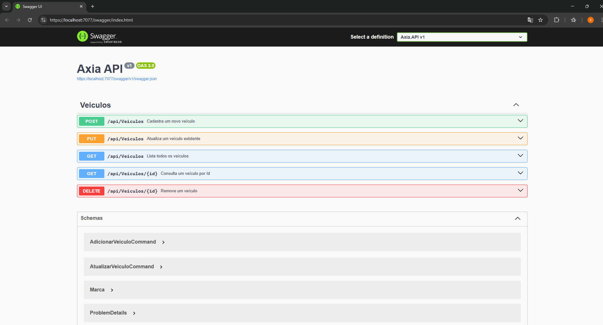

# Axia Vehicle API

API para gerenciamento de veículos, implementada com **.NET 8**, MediatR e arquitetura CQRS (Commands, Queries e Handlers).

---

## Repositório
[GitHub - Axia Veiculo API](https://github.com/vitohpx/Axia.git)

---

## Como executar o projeto

### Pré-requisitos
- [.NET 8 SDK](https://dotnet.microsoft.com/en-us/download/dotnet/8.0)
- IDE (Visual Studio 2022/2023, VS Code ou Rider)
- Navegador para acessar Swagger

### Passos
1. Clone o repositório:
   ```bash
   git clone https://github.com/vitohpx/Axia.git
   cd Axia

2. dotnet restore

3. dotnet run

4. Acessar a documentação e testar os endpoints via Swagger em:
https://localhost:7077/swagger/index.html


## Endpoints da API



---


Observações

Validações de entrada são feitas com FluentValidation.

Em caso de erro de validação, a API retorna HTTP 400 com mensagens detalhadas.

CQRS + MediatR garante separação de responsabilidades entre Commands e Queries.

A documentação e testes da API podem ser feitos diretamente pelo Swagger UI em https://localhost:7077/swagger/index.html
